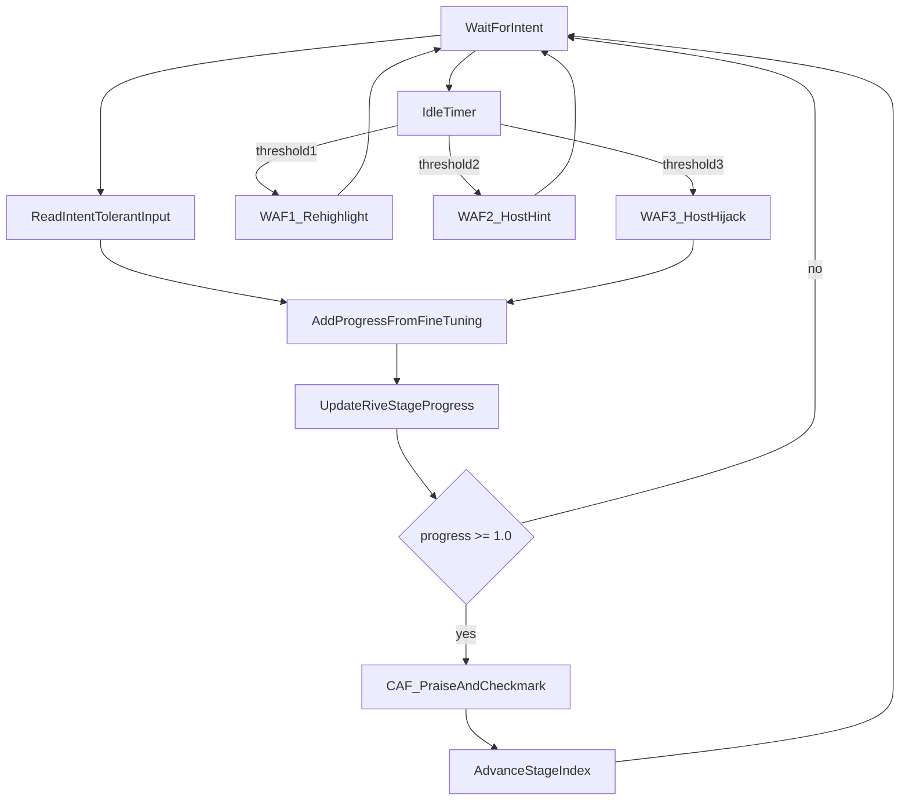

# Core loop — Manos Limpias

Design version: **v1**

Player intent on the active focus fills the current stage bar. Completing a stage triggers CAF and unlocks the next stage. Idle time escalates WAF without punishing the player.

## Notes

- Only one stage accepts input at a time.
- Hijack (WAF3) drives the same progress pipeline so assist and player share one completion rule.
- Rates and idle thresholds: `FineTuningVariables`.
