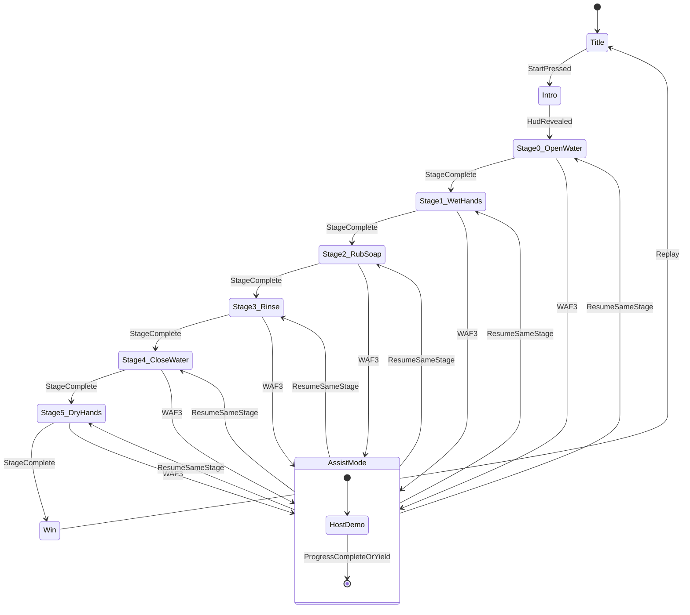

# Game states — Manos Limpias

Design version: **v1**

High-level session state machine. Play contains six ordered stages; assist is a nested mode that returns to the same stage.

## Notes

- No pause/lose states in MVP.
- Resume after assist returns to the **same** stage index with progress preserved (or advanced if hijack completed the bar).
