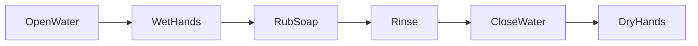
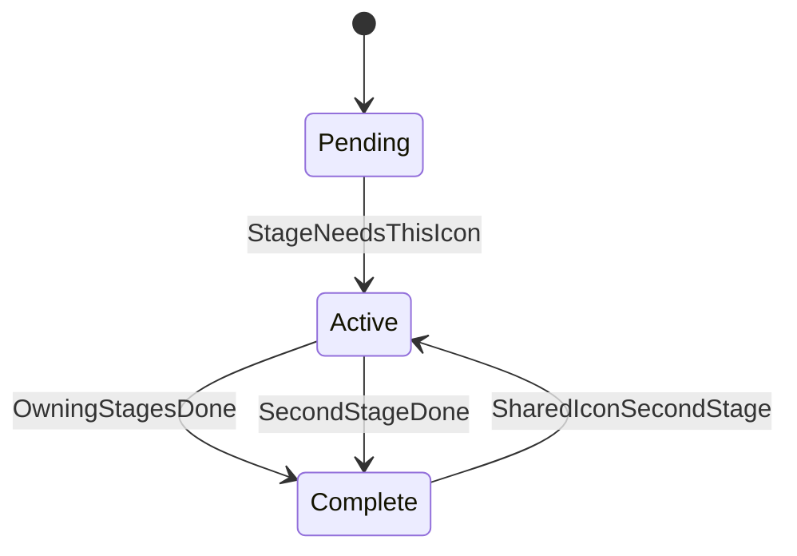

# Progression — Manos Limpias

Design version: **v1**

Linear six-stage wash sequence. HUD shows four icons; shared icons reactivate for their second logical stage.

## Stage sequence

## Icon state machine (per icon)

## Icon ownership

| Icon id | Label | Owns stages |
|---------|-------|-------------|
| `icon0` | Faucet | 0 Open, 4 Close |
| `icon1` | Wet/Rinse | 1 Wet, 3 Rinse |
| `icon2` | Soap | 2 Rub soap |
| `icon3` | Towel | 5 Dry |

## Economy

None — no currency, XP, or unlocks in MVP.
