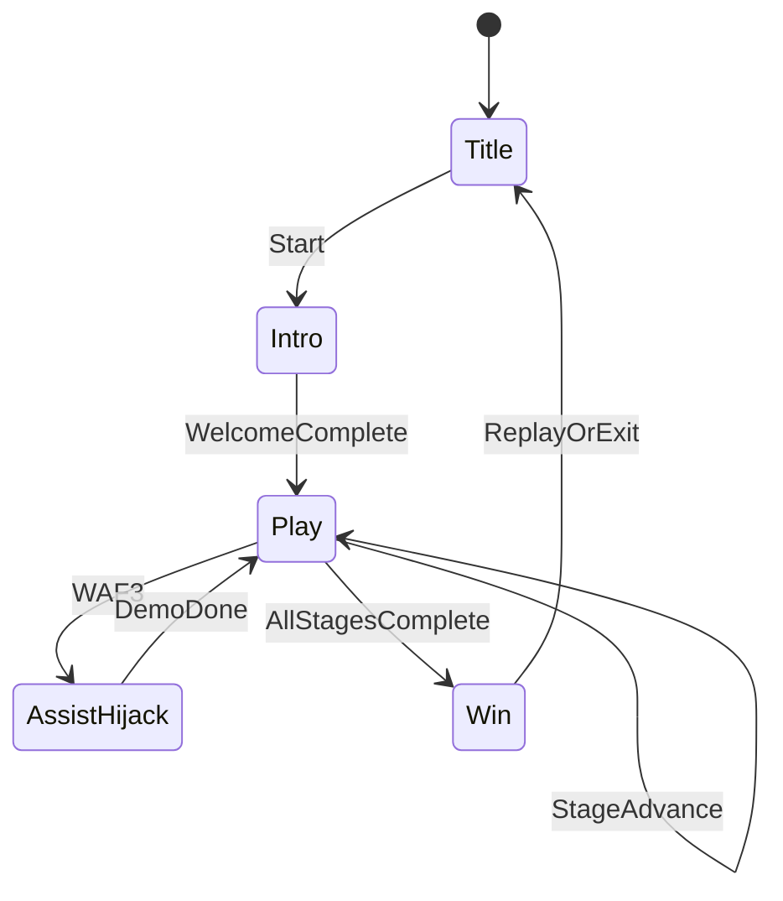

# Screen Map

Design version: **v1**  
Game: **Manos Limpias**  
Reference sketch: [`refs/hud-sketch.png`](refs/hud-sketch.png)

## Screen inventory

| Screen | Purpose | Canvas mockup | Entry | Exit |
|--------|---------|---------------|-------|------|
| Title | Brand + start; “Manos Limpias” | `canvases/title.canvas.tsx` | App launch | Intro |
| Intro | Host welcome VO; camera ease into play; HUD reveals | _(same play canvas, intro mode)_ | Title → Play | First stage active |
| Play | Six hygiene stages + Rive HUD + assist | `canvases/play-hud.canvas.tsx` | Intro complete | Win |
| Win | Clean hands, host praise, replay/exit | _(play canvas win overlay)_ | Stage 5 complete | Title |

## Navigation flow

## Per-screen intent

### Title

**Intent:** Establish the product name and invite a short play session. Brand “Manos Limpias” / Dr. Simi collection should read clearly before any hygiene instruction.

**Key elements:**
- Title lockup (graybox text OK)
- Single primary CTA (Jugar / Start)
- Optional quiet host silhouette — no full HUD yet

**Canvas:** [`canvases/title.canvas.tsx`](../../../../canvases/title.canvas.tsx)

### Intro

**Intent:** Host welcomes the child, states the challenge, then yields so the camera eases slightly toward the sink and the HUD appears with step 0 active.

**Key elements:**
- Host VO welcome (silent placeholder `vo_welcome`)
- Camera ease toward play framing
- HUD fade-in: top bar empty, right icons pending, faucet icon active

**Canvas:** Covered by play-hud canvas (intro annotation)

### Play

**Intent:** One available stage at a time. Child performs intentful input at the camera focus; top bar fills; icons update; host intervenes only via CAF/WAF. Layout matches sketch: top progress, **right** icon column, bottom-left host, center first-person hands + props.

**Key elements:**
- Top stage progress bar (0–1)
- Right column: 4 icons (faucet, wet/rinse, soap, towel)
- Host portrait (assist / VO)
- Graybox foci: faucet (top), soap (left), towel (right), hands (center)

**Canvas:** [`canvases/play-hud.canvas.tsx`](../../../../canvases/play-hud.canvas.tsx)

### Win

**Intent:** Celebrate completion: hands look clean/shiny (graybox), host praises, offer replay. No score chase.

**Key elements:**
- Completion VO (`vo_complete`)
- All icons complete
- Replay CTA

**Canvas:** Play-hud win overlay note
