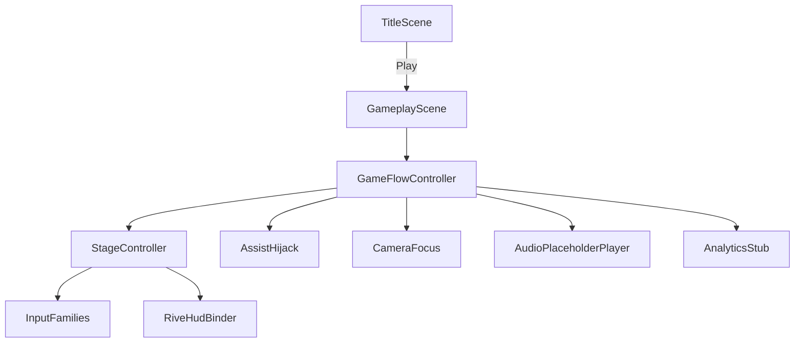

# Technical Approach Document — Manos Limpias (v1)

GDD reference: [`../design/GDD-v1.md`](../design/GDD-v1.md)

## Architecture overview

Unity 2D orthographic minigame at fixed **1920×1080**, WebGL-first. Session flow lives in a state machine; HUD chrome is Rive-owned; playfield graybox is Unity-native.

- **Render / perspective:** 2D orthographic (first-person sink framing via camera + sprites)
- **Scene strategy:** `Title` + `Gameplay` (intro / six stages / assist / win as states inside Gameplay)
- **Core systems:**
  - `GameFlowController` — Title → Intro → Stage → Assist → Win
  - `StageController` — stage index 0–5, progress 0–1, CAF advance
  - `InputFamilies` — `TapOpenClose`, `HandsUnderWater`, `RubOnHands` (intent-tolerant)
  - `AssistHijack` — WAF3 host demo driving the same progress pipeline
  - `CameraFocus` — ease toward active stage focus
  - `RiveHudBinder` — ViewModel / SM inputs per [`../design/RIVE_INTERFACES.md`](../design/RIVE_INTERFACES.md)
  - `AudioPlaceholderPlayer` — silent clip keys
  - `AnalyticsStub` — Debug.Log / no-op sink for MVP events
- **Data approach:** ScriptableObject `FineTuningVariables` (rates, WAF timers, camera ease, hijack speed); Resources/StreamingAssets for `.riv`
- **Namespaces / folder layout:** `Assets/Scripts/{Core,Input,UI,Audio,Analytics}`, `Assets/Scenes`, `Assets/Data`, `Assets/Art/Rive`
- **Required package:** `com.unity.ai.assistant` in `Packages/manifest.json` (Unity MCP for Cursor — never omit)

## Tooling

| Concern | Approach for MVP | Notes |
|---------|------------------|-------|
| Level building | Unity scenes + graybox GameObjects | No Tilemap required |
| Level / content loading | `SceneManager` Title ↔ Gameplay | Single vertical slice |
| Asset management | Folders under `Assets/Art`, `Assets/Data` | Addressables deferred |
| Variable tweaking | `FineTuningVariables` ScriptableObject | Inspector-editable |
| Editor tools | Optional `ManosLimpiasSetup` menu to wire scenes | Only if YAML wiring is brittle |

## Asset creation pipeline

| Asset class | Tool | Export into Unity | MVP scope |
|-------------|------|-------------------|-----------|
| UI / HUD motion | Rive | `.riv` → `Assets/Art/Rive/` | In |
| Playfield graybox | Unity-native | Sprites / primitives | In |
| Optional water/soap FX | Rive or Unity particles | Nested artboard or ParticleSystem | Nice-to-have |
| 3D meshes / rigs | Blender | — | Out |
| Concept / textures | ComfyUI | — | Out (post-MVP look-dev only) |

**ComfyUI for this project:** unused for MVP (post-MVP look-dev only)

**Export formats / import rules:**

- Rive: open `protosimi` / `ManosLimpias_HUD.riv`; artboard `AB_HUD_Root`; bind ViewModel names exactly as RIVE_INTERFACES
- Unity sprites: PNG or generated Texture2D sprites for faucet/soap/towel/hands graybox
- Audio: empty/silent `AudioClip` assets with stable keys (no generated banks)

## Analytics event catalog

| Event name | Trigger | Payload | Design question answered |
|------------|---------|---------|--------------------------|
| `session_start` | App / Title load | `design_version` | Are sessions instrumented? |
| `play_pressed` | Title CTA | — | Drop-off before play? |
| `stage_start` | Stage index becomes active | `stageIndex` | Where do players enter each step? |
| `stage_complete` | CAF / progress ≥ 1 | `stageIndex`, `duration_s` | Which stages are slow? |
| `waf_triggered` | WAF1/2/3 fires | `stageIndex`, `level` | How often is help needed? |
| `assist_hijack` | WAF3 host demo starts | `stageIndex` | Does assist complete stages? |
| `session_complete` | Win reached | `total_s` | Do players finish the wash? |

MVP implementation: `AnalyticsStub` logs to console; no external SDK.

## Roadmap constraints

- **Front-load (M-01 / early):** Unity scaffold + `com.unity.ai.assistant`, `FineTuningVariables`, `AnalyticsStub`, 1920×1080 Game view
- **Must exist before content milestones:** StageController + input families (M-02); Rive HUD binder contract (M-03)
- **Sequencing risks:** Rive Unity package / ViewModel binding may lag — keep Unity debug HUD fallback; still author `.riv` contract
- **Capacity / skill notes:** Unity MCP may be unavailable — prefer file scripts + Editor setup; Rive MCP for HUD artboards
- **Persistence:** None for MVP (session-only). M-04 = formal state machine + analytics, not disk save

## Architecture diagrams

Optional: `docs/inception/tech/diagrams/` (system map deferred; see mermaid above).

## Open technical questions

- [x] Spanish (MX) assumed for copy placeholders — silent VO keys only in MVP
- [x] Germ pop VFX: nice-to-have in M-05; not blocking vertical slice
- [x] Rive file: use open `protosimi` project; export as `Assets/Art/Rive/ManosLimpias_HUD.riv`
- [ ] Exact Rive Unity package version pin after first successful import

## Approval

- [x] User approved this TAD version for milestone planning (fast-track auto-approve)
