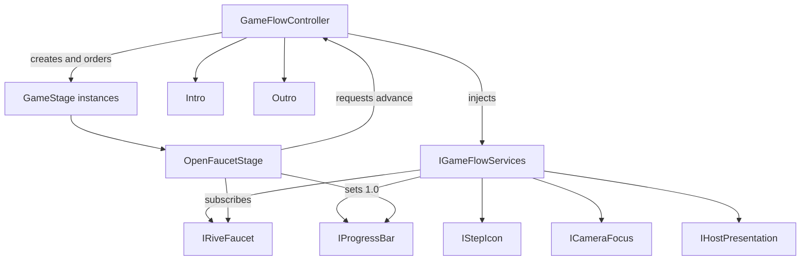

# Technical Approach Document — Manos Limpias (v2)

**GDD reference:** [`../design/GDD-v2.md`](../design/GDD-v2.md)  
**Supersedes:** [`TAD-v1.md`](TAD-v1.md) for future implementation planning  
**Reason for revision:** Decouple stage behavior from flow sequencing through a polymorphic `GameStage` and an injected `IGameFlowServices` interface.

## Architecture

`GameFlowController` becomes the composition root and lifecycle coordinator. It does not know how a stage completes or which gameplay controls a stage uses.

Each stage is a concrete `GameStage` implementation. The controller creates the ordered runtime list, injects the service interface, enters one stage at a time, and advances only after that stage requests completion.

## Core contracts

### `GameStage`

`GameStage` is the base class for stage-specific behavior:

- receives `IGameFlowServices` once before entry;
- exposes `OnEnter()` and `OnExit()` lifecycle methods;
- may expose `Tick(float deltaTime)` for continuous input families;
- requests completion through the injected flow service rather than calling another stage directly;
- owns no scene lookup, global singleton, or hard-coded next-stage index.

The stage must unsubscribe from all service events in `OnExit()` so the inactive stage cannot react to later input.

### `IGameFlowServices`

The interface is supplied by `GameFlowController` and exposes narrow capabilities:

- Faucet enable/disable/reset state and left/right activation event;
- current-stage progress value and progress reset/fill operations;
- active `StepIcon` selection and completion state;
- camera focus and host presentation commands where needed;
- `RequestStageCompletion()` for the active stage;
- read-only session state and active stage order information.

Concrete Rive and Unity adapters implement these capabilities. `GameStage` depends on the interface, never on `RiveWidget`, `GameObject`, `HudPresenter`, or `GameFlowController`.

## Stage list and lifecycle

The controller owns an ordered serialized list of stage factories/configurations. At runtime it instantiates each configured stage, injects the service object, and tracks an index:

1. Enter Intro and prepare the first stage.
2. On intro dismissal, call `Enter()` on stage index 0.
3. The active stage enables its controls and subscribes to events.
4. On `RequestStageCompletion()`, the controller fills/commits progress, calls the active stage’s `OnExit()`, increments the index, and enters the next stage.
5. After the final list item exits, transition to Outro.
6. Replay resets the list and returns to Intro/Title without retaining stage state.

The controller may reject completion requests from inactive or already-exited stages. It must not use `StageController.FamilyFor()` or stage-index switches to determine behavior.

## Stage configuration strategy

Use Unity-serializable stage assets/factories so designers can reorder or replace stages without editing flow code. The serialized list contains the concrete type/configuration in play order. Runtime stage instances are independent of the asset/configuration state.

M-07 configures one `OpenFaucetStage`. The remaining six-stage entries are added in later milestones as their concrete classes become available.

## Rive integration

- `RiveHudBinder` implements the progress and StepIcon portions of `IGameFlowServices`.
- `Faucet` exposes a stable left/right activation event and an enabled state; it remains bound to the nested `main` Rive widget.
- `OpenFaucetStage` listens to the Faucet event, accepts either side, sets progress to `1`, and requests completion.
- Rive state-machine names remain those in [`../design/RIVE_INTERFACES.md`](../design/RIVE_INTERFACES.md) and the `simi_prototype.riv` discrepancy note.
- No stage class directly resolves nested Rive input paths.

## Existing system responsibilities

- `GameFlowController`: lifecycle, ordered stage creation, transition guards, Intro/Outro, replay, and service implementation.
- `GameStage`: one stage’s behavior and subscriptions.
- `StageController`: deprecated as the sequencing owner; retain only if needed as a data/progress adapter during the migration, then remove from the flow path.
- `IntentInputRouter`: continuous non-Rive input adapter only; it must not own Faucet completion.
- `WafController`, `AssistHijack`, `CameraFocus`, audio, and analytics: accessed by the service implementation, not by concrete stage classes.

## Testing

- EditMode tests instantiate a flow with fake service adapters and verify ordered entry, exit-before-next-entry, inactive-stage rejection, and final-stage Outro.
- Stage unit tests verify `OpenFaucetStage` subscribes on entry, accepts both Faucet sides, fills progress once, requests completion once, and unsubscribes on exit.
- PlayMode acceptance verifies Intro → `OpenFaucetStage` → next configured stage/Outro with the real Rive Faucet and progress bar.

## Approval

- [x] User approves this TAD revision for milestone planning.
