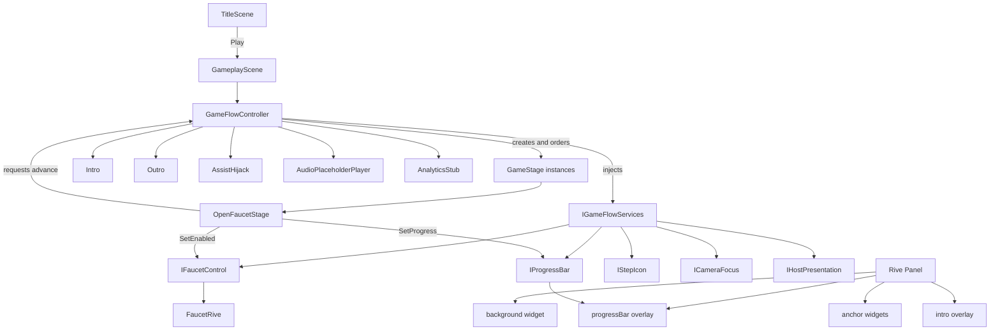

# Technical Approach Document — Manos Limpias (v3)

**GDD reference:** [`../design/GDD-v2.md`](../design/GDD-v2.md)

Current technical approach. `GameFlowController` is the composition root; concrete `GameStage` instances consume `IGameFlowServices`. Gameplay Rive mounts a `background` shell with sibling artboard widgets at named `*-anchor` nodes and a separate `progressBar` overlay.

## Architecture overview

Unity 2D orthographic minigame at fixed **1920×1080**, WebGL-first. Session flow lives in `GameFlowController`; HUD and playfield chrome are Rive-owned; leftover Unity graybox remains until each component is migrated.

- **Render / perspective:** 2D orthographic (first-person sink framing)
- **Scene strategy:** `Title` + `Gameplay` (intro / ordered stages / assist / win as states inside Gameplay)
- **Core systems:**
  - `GameFlowController` — composition root: Title → Intro → ordered `GameStage` instances → Outro; injects `IGameFlowServices`
  - `GameStage` — one stage’s behavior and subscriptions (`OpenFaucetStage` is the only concrete gameplay stage today)
  - `InputFamilies` — `TapOpenClose`, `HandsUnderWater`, `RubOnHands` (intent-tolerant); `IntentInputRouter` is a continuous non-Rive adapter only
  - `AssistHijack` — WAF3 host demo driving the same progress pipeline
  - `CameraFocus` — ease toward active stage focus
  - `RiveHudBinder` — progress and StepIcon portions of `IGameFlowServices`
  - `AudioPlaceholderPlayer` — silent clip keys
  - `AnalyticsStub` — Debug.Log / no-op sink for MVP events
- **Data approach:** ScriptableObject `FineTuningVariables` (rates, WAF timers, camera ease, hijack speed); `.riv` under `Assets/Art/Rive/`
- **Namespaces / folder layout:** `Assets/Scripts/{Core,Input,UI,Audio,Analytics}`, `Assets/Scenes`, `Assets/Data`, `Assets/Art/Rive`
- **Required package:** `com.unity.ai.assistant` in `Packages/manifest.json` (Unity MCP for Cursor — never omit)

## Core contracts

### `GameStage`

`GameStage` is the base class for stage-specific behavior:

- receives `IGameFlowServices` once before entry;
- exposes `OnEnter()` and `OnExit()` lifecycle methods;
- may expose `Tick(float deltaTime)` for continuous input families;
- requests completion through the injected flow service rather than calling another stage directly;
- owns no scene lookup, global singleton, or hard-coded next-stage index.

The stage must unsubscribe from all service events in `OnExit()` so the inactive stage cannot react to later input.

### `IGameFlowServices`

The interface is supplied by `GameFlowController` and exposes narrow capabilities:

- Faucet enable/disable/reset state and left/right activation event;
- current-stage progress value and progress reset/fill operations;
- active `StepIcon` selection and completion state;
- camera focus and host presentation commands where needed;
- `RequestStageCompletion()` for the active stage;
- read-only session state and active stage order information.

Concrete Rive and Unity adapters implement these capabilities. `GameStage` depends on the interface, never on `RiveWidget`, `GameObject`, `HudPresenter`, or `GameFlowController`.

## Stage list and lifecycle

The controller owns an ordered serialized list of stage factories/configurations. At runtime it instantiates each configured stage, injects the service object, and tracks an index:

1. Enter Intro and prepare the first stage.
2. On intro dismissal, call `Enter()` on stage index 0.
3. The active stage enables its controls and subscribes to events.
4. On `RequestStageCompletion()`, the controller fills/commits progress, calls the active stage’s `OnExit()`, increments the index, and enters the next stage.
5. After the final list item exits, transition to Outro.
6. Replay resets the list and returns to Intro/Title without retaining stage state.

The controller may reject completion requests from inactive or already-exited stages. It must not use stage-index switches to determine behavior.

Use Unity-serializable stage assets/factories so designers can reorder or replace stages without editing flow code. The serialized list currently contains one `OpenFaucetStage`. Later stage classes can be added without changing `GameFlowController` sequencing code.

## Rive integration

- Gameplay mounts artboard `background` as a fullscreen, non-hittable shell (`HitTestBehavior.None`).
- Named nodes on `background` (`faucet-anchor`, `soap-anchor`, `towel-anchor`, `hands-anchor`, `character-anchor`, `step1-anchor`…`step4-anchor`, `progressBar-anchor`) are empty groups (no drawable AABB; Rive Unity `ComputeBounds()` is 0). Unity spawns a sibling `RiveWidget` per component, places it from the node’s artboard x/y plus the component artboard size shifted by that artboard’s origin (0–1), and maps that box through Fit.Contain + Center with a Y-down → uGUI flip.
- `progressBar` is a sibling overlay (not nested in `background`), placed at `progressBar-anchor`.
- `intro` remains a fullscreen overlay above the playfield.
- Leftover artboard `main` is not mounted.
- `RiveHudBinder` writes progress to the overlay `progressBar` widget and drives four `stepIcon` widgets by id.
- `Faucet` binds to the dedicated faucet widget. `SetEnabled` toggles that widget’s `HitTestBehavior` (`Translucent` when enabled, `None` when disabled). Components stay visible; only the active stage’s interactable receives hits.
- Hands, soap, towel, and character are mounted and remain `HitTestBehavior.None` until later stages exist.
- `OpenFaucetStage` listens to the Faucet event, accepts either side, sets progress to `1`, and requests completion.
- Rive state-machine names: [`../design/RIVE_INTERFACES.md`](../design/RIVE_INTERFACES.md) and [`../design/RIVE_PROTOTYPE_DISCREPANCIES.md`](../design/RIVE_PROTOTYPE_DISCREPANCIES.md).
- No stage class resolves Rive node names, widgets, or input paths.

## System responsibilities

- `GameFlowController`: lifecycle, ordered stage creation, transition guards, Intro/Outro, replay, and service implementation.
- `GameStage`: one stage’s behavior and subscriptions.
- `IntentInputRouter`: continuous non-Rive input adapter only; it must not own Faucet completion.
- `WafController`, `AssistHijack`, `CameraFocus`, audio, and analytics: accessed by the service implementation, not by concrete stage classes.

## Tooling

| Concern | Approach for MVP | Notes |
|---------|------------------|-------|
| Level building | Unity scenes + graybox GameObjects | No Tilemap required |
| Level / content loading | `SceneManager` Title ↔ Gameplay | Single vertical slice |
| Asset management | Folders under `Assets/Art`, `Assets/Data` | Addressables deferred |
| Variable tweaking | `FineTuningVariables` ScriptableObject | Inspector-editable |
| Editor tools | Optional `ManosLimpiasSetup` menu to wire scenes | Only if YAML wiring is brittle |

## Asset creation pipeline

| Asset class | Tool | Export into Unity | MVP scope |
|-------------|------|-------------------|-----------|
| UI / HUD / playfield motion | Rive | `.riv` → `Assets/Art/Rive/` | In |
| Playfield graybox | Unity-native | Sprites / primitives | In (hide as each component migrates to Rive) |
| Optional water/soap FX | Rive or Unity particles | Nested artboard or ParticleSystem | Nice-to-have |
| 3D meshes / rigs | Blender | — | Out |
| Concept / textures | ComfyUI | — | Out (post-MVP look-dev only) |

**ComfyUI for this project:** unused for MVP (post-MVP look-dev only)

**Export formats / import rules:**

- Rive: `Assets/Art/Rive/simi_prototype.riv`; mount `background` plus sibling widgets at `*-anchor` nodes (see discrepancy note)
- Unity sprites: PNG or generated Texture2D sprites for remaining graybox
- Audio: empty/silent `AudioClip` assets with stable keys (no generated banks)

**Linux Editor:** Rive Unity 0.4.3 only renders with **Vulkan**.

## Analytics event catalog

| Event name | Trigger | Payload | Design question answered |
|------------|---------|---------|--------------------------|
| `session_start` | App / Title load | `design_version` | Are sessions instrumented? |
| `play_pressed` | Title CTA | — | Drop-off before play? |
| `stage_start` | Stage index becomes active | `stageIndex` | Where do players enter each step? |
| `stage_complete` | CAF / progress ≥ 1 | `stageIndex`, `duration_s` | Which stages are slow? |
| `waf_triggered` | WAF1/2/3 fires | `stageIndex`, `level` | How often is help needed? |
| `assist_hijack` | WAF3 host demo starts | `stageIndex` | Does assist complete stages? |
| `session_complete` | Win reached | `total_s` | Do players finish the wash? |

MVP implementation: `AnalyticsStub` logs to console; no external SDK.

## Constraints

- Unity scaffold includes `com.unity.ai.assistant`, `FineTuningVariables`, `AnalyticsStub`, 1920×1080 Game view.
- Sequencing risk: Rive Unity package / ViewModel binding may lag — keep Unity debug HUD fallback; still author `.riv` contract.
- Unity MCP may be unavailable — prefer file scripts + Editor setup; Rive MCP for artboards.
- Persistence: none for MVP (session-only). Formal state machine + analytics are in-memory, not disk save.

## Open technical questions

- [x] Spanish (MX) assumed for copy placeholders — silent VO keys only in MVP
- [x] Germ pop VFX: nice-to-have; not blocking vertical slice
- [x] Rive file: `Assets/Art/Rive/simi_prototype.riv` with background-anchor harness
- [ ] Exact Rive Unity package version pin after first successful import (0.4.3 in use)

## Testing

**EditMode:** AABB → view-rect mapping; disabled Faucet ignores activation and sets `HitTestBehavior.None`; flow with fake service adapters verifies ordered entry, exit-before-next-entry, inactive-stage rejection, and final-stage Outro; `OpenFaucetStage` subscribes on entry, accepts both Faucet sides, fills progress once, requests completion once, and unsubscribes on exit.

**PlayMode:** background widget is present (not artboard `main`); intro still dismisses into the first `GameStage`.

**Playtest:** Unity Editor, Vulkan on Linux (Rive 0.4.3). Open `Assets/Scenes/Gameplay.unity`, press Play, confirm the intro overlay and `background` playfield with sibling widgets at faucet/hands/soap/towel/character/step/progressBar anchors. Press `Jugar`; expect intro to dismiss and `OpenFaucetStage` to enable only the Faucet. Hands/soap/towel/character must not consume pointer hits. Activate either Faucet handle; expect overlay progress to fill and the stage to complete.
