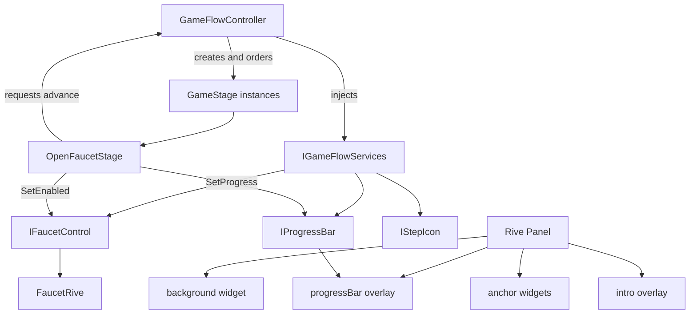

# Technical Approach Document — Manos Limpias (v3)

**GDD reference:** [`../design/GDD-v2.md`](../design/GDD-v2.md)  
**Supersedes:** [`TAD-v2.md`](TAD-v2.md) for future implementation planning  
**Reason for revision:** Replace the nested `main` Rive widget with a `background` shell, sibling artboard widgets at named `*-anchor` nodes, and a separate `progressBar` overlay. `GameStage` / `IGameFlowServices` from v2 are unchanged.

## Architecture

Unchanged from TAD-v2: `GameFlowController` is the composition root. Concrete `GameStage` instances consume `IGameFlowServices` and request completion through that interface.

## Rive integration

- Gameplay mounts artboard `background` as a fullscreen, non-hittable shell (`HitTestBehavior.None`).
- Named nodes on `background` (`faucet-anchor`, `soap-anchor`, `towel-anchor`, `hands-anchor`, `character-anchor`, `step1-anchor`…`step4-anchor`, `progressBar-anchor`) are empty groups (no drawable AABB; Rive Unity `ComputeBounds()` is 0). Unity spawns a sibling `RiveWidget` per component, places it from the node’s artboard x/y plus the component artboard size shifted by that artboard’s origin (0–1), and maps that box through Fit.Contain + Center with a Y-down → uGUI flip.
- `progressBar` is a sibling overlay (not nested in `background`), placed at `progressBar-anchor`.
- `intro` remains a fullscreen overlay above the playfield.
- Leftover artboard `main` is not mounted.
- `RiveHudBinder` writes progress to the overlay `progressBar` widget and drives four `stepIcon` widgets by id.
- `Faucet` binds to the dedicated faucet widget. `SetEnabled` toggles that widget’s `HitTestBehavior` (`Translucent` when enabled, `None` when disabled). Components stay visible; only the active stage’s interactable receives hits.
- Hands, soap, towel, and character mount in M-08 but remain `HitTestBehavior.None` until later stages exist.
- No stage class resolves Rive node names, widgets, or input paths.

## Unchanged from TAD-v2

- `GameStage` lifecycle, `IGameFlowServices`, ordered stage factories, Intro/Outro as flow states.
- `OpenFaucetStage` is the only concrete gameplay stage in this revision.
- Analytics, audio placeholders, WAF, camera, and graybox Unity playfield responsibilities.

## Testing

- EditMode: AABB → view-rect mapping; disabled Faucet ignores activation and sets `HitTestBehavior.None`.
- Existing M-07b GameStage tests remain valid.
- PlayMode: background widget is present; intro still dismisses.

## Approval

- [x] User approved this Rive harness revision with the M-08 implementation plan.
